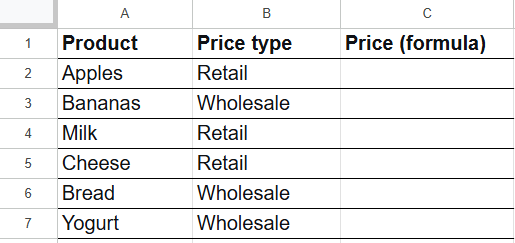
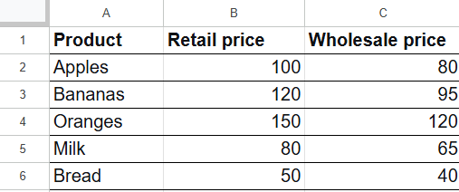

# VLOOKUP with Category Selection and Error Handling

**Reading time:** 5 minutes  
**Difficulty level:** intermediate 

**Target audience:** users who are confident with VLOOKUP and the IF function and know how to reference another sheet.

This document uses two tables as an example to demonstrate how to use a smart VLOOKUP with error handling and category selection.

There are two tables on two sheets: Orders and Price list.

*Fig. Orders table. The "Price" column is currently empty and needs to be filled.*

*Fig. Price list table. Products and two price types.*

**Task:** Fill in the "Price" column in the "Orders" table: for each product, determine the price type (retail or wholesale), find the corresponding price in the price list, and if the product is missing — display "out of stock".

The solution consists of three steps:

1. **VLOOKUP.** Compare two columns across tables.
2. **Category selection** for products that exist in the Price list: retail or wholesale. The price is calculated based on the category.
3. **Error handling** for products not found in the Price list: fill the Price column with "out of stock".