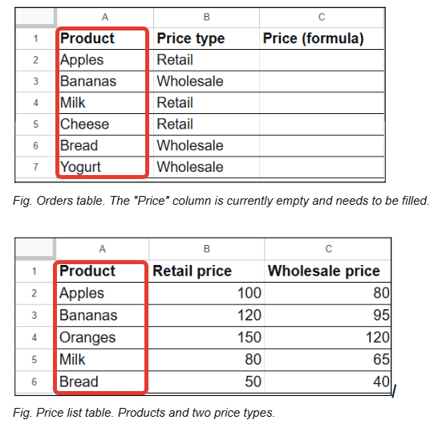

## Step 1. VLOOKUP. Compare two columns across tables.

Check whether a product from the "Orders" table exists in the "Price list" table.



*Fig. Column comparison: the VLOOKUP formula checks if a product from the order exists in the price list.*

You can compare two columns from two different tables using the VLOOKUP formula:

```excel
=VLOOKUP( A2 ; 'Price list'!A:C ; 3 ; FALSE )
```

**What the arguments mean:**

```text
A2: what to look up (product)
'Price list'!A:C: where to look (range, first column contains products)
3: where to take from (third column of the range — wholesale price)
FALSE: exact match
```
