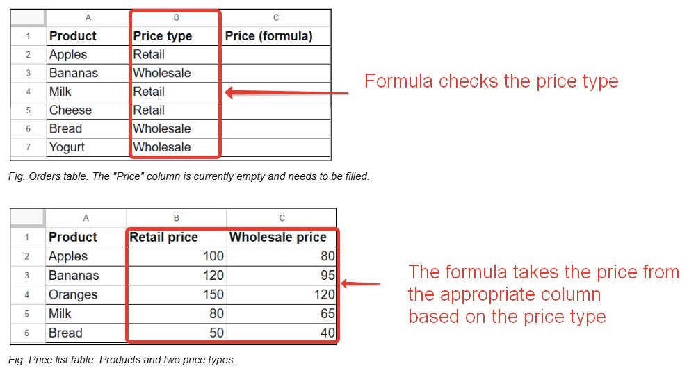

## Step 2. Category selection for products that exist in the Price list: retail or wholesale.

**If the product exists**, check the price type in the "Orders" table: retail or wholesale. Then take the price from the appropriate column based on the price type.



*Fig. Category selection and price calculation.*

Find the number ***3*** in the VLOOKUP formula (the column number for "Wholesale price"):

```excel
=VLOOKUP( A2 ; 'Price list'!A:C ; 3 ; FALSE )
```

Replace the number 3 with an IF condition:

```excel
=VLOOKUP( A2 ; 'Price list'!A:C ; IF( B2="Retail" ; 2 ; 3 ) ; FALSE )
```
