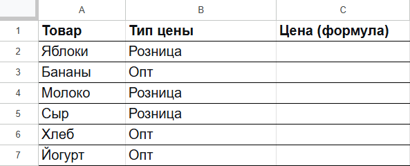
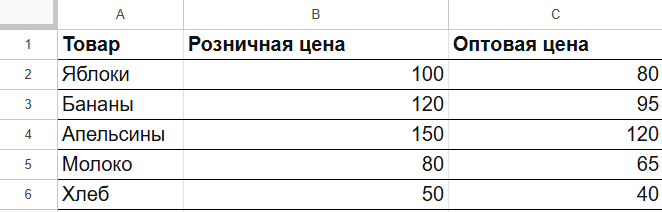

# ВПР с выбором категории и обработкой ошибок

**Время чтения:** 5 минут  
**Уровень сложности:** средний

**На каких пользователей рассчитан документ:** на пользователей, которые уверенно владеют ВПР и функцией «Если» и знают, как ссылаться на другой лист.

В документе на примере двух таблиц показано, как использовать умный ВПР с обработкой ошибок и выбором категории.

Есть две таблицы на двух листах: заказы и прайс-лист.

*Рис. Таблица «Заказы». Колонка «Цена» пока пустая, её нужно заполнить.*

*Рис. Таблица «Прайс-лист». Товары и два вида цен.*

**Задача:** Заполнить колонку «Цена» в таблице «Заказы»: для каждого товара определить тип цены (розница или опт), найти соответствующую цену в прайс-листе, а если товар отсутствует — указать «нет в наличии».

Решение задачи состоит из трех этапов:

1. **ВПР**. Сравнение двух колонок в таблицах.
2. **Выбор категории** для товаров, которые есть в Прайс-листе: розница или опт. Исходя из категории рассчитывается цена.
3. **Обработка ошибок** для товаров, которых нет в Прайс-листе: заполнить колонку Цена значением «нет в наличии».
