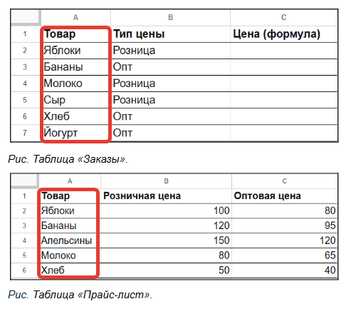

## Этап 1. ВПР. Сравнение двух колонок в таблицах.

Посмотреть, есть ли товар из таблицы «Заказы» в таблице «Прайс-лист».


*Рис. Сравнение колонок: формула ВПР проверяет, есть ли товар из заказа в прайс-листе.*

Сравнить две колонки из двух разных таблиц можно с помощью формулы ВПР:

```excel
=ВПР( A2 ; 'Прайс-лист'!A:C ; 3 ; 0 )
```

**Что означают аргументы:**

```text
A2: что ищем (товар)
'Прайс-лист'!A:C: где ищем (диапазон, первый столбец — товары)
3: откуда берём (третий столбец диапазона — оптовая цена)
0: точное совпадение
```