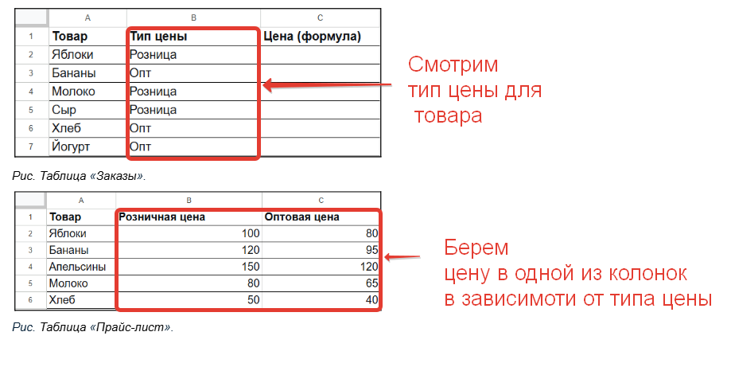

## Этап 2. Выбор категории для товаров, которые есть в Прайс-листе: розница или опт.

**Если товар есть**, посмотреть тип цены в таблице «Заказы»: розница или опт. Затем взять цену из нужной колонки в зависимости от типа цены.


*Рис. Выбор категории и расчет цены.*

Найдите в формуле ВПР цифру 3 (номер колонки «Оптовая цена»):

```excel
=ВПР( A2 ; 'Прайс-лист'!A:C ; 3 ; 0 )
```

Вместо цифры 3 добавьте условие ЕСЛИ:

```excel
=ВПР( A2 ; 'Прайс-лист'!A:C ; ЕСЛИ( B2="Розница" ; 2 ; 3 ) ; 0 )
```

